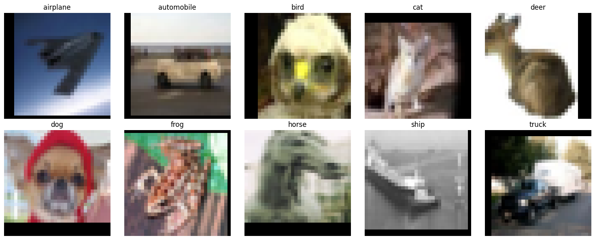
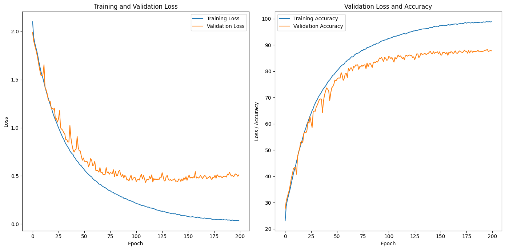
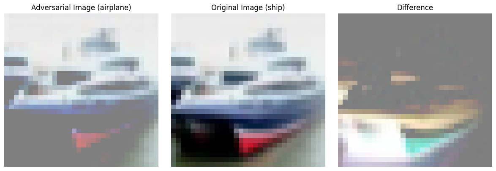

# Understanding and Detecting Adversarial Behavior in Neural Networks

This repository contains the code and experimental framework for an ongoing research project that investigates **adversarial behavior in neural networks**.
The project aims to explore how neural architectures react to adversarial perturbations, to better understand the mechanisms behind their vulnerabilities, and to investigate whether such perturbations can be **detected or explained** effectively. This work is based on several paper and open-source framework referenced at the end of this file.


## Overview

This work presents a systematic study of adversarial robustness and internal representation dynamics in deep convolutional neural networks. I implement a ResNet architecture from first principles using PyTorch and evaluate its behavior under several well-established adversarial attack, including the FGSM, DeepFool, and C&W attacks. By analyzing activation patterns across network layers, we investigate how adversarial perturbations influence feature representations throughout the model hierarchy. Furthermore, we explore adversarial example detection strategies based on activation-space statistics and explainability-driven analyses.

Model performance and representational divergence are quantitatively assessed using classification accuracy and cosine similarity between layer-wise activation tensors.

All experiments are conducted on the CIFAR10 dataset and detailed results will be added progressively as experimentation progresses.


#### **Data Details**

CIFAR-10 is a standard benchmark dataset for image classification tasks. It consists of **60,000 color images**, each with a resolution of **32 × 32 pixels** and **3 color channels (RGB)** separated into 50,000 images as the **Training Set** and 10,000 images as the **Test Set**. Images are evenly distributed across all classes.

The dataset contains **10 object categories**, with **6,000 images per class**:


#### **Prediction Task:**

The ultimate goal is to be able to **detect adversarial elements** generated from DeepFool or Carlini&Wanger algorithms.

## Repo Structure

```
├── data/              # Data importation
├── model/             # Custom ResNet and architecture modules
├── attacks/           # Adversarial examples used
├── utils/             # Helper utilities for data, plotting, etc.
├── main.ipynb         # Jupyter notebook used for exploration
├── requirements.txt   # Dependencies used
└── README.md          # This document
```

## Results




---

## Citation

If you use or refer to this repository, please cite:

> **MANUEL** (2025). *Understanding and Detecting Adversarial Behavior in Neural Networks*. GitHub repository: [[https://github.com/](https://github.com/maegonz/Adversarial-Study)]


## License

This repository is licensed under the **GNU License** (see [LICENSE](./LICENSE) for details).
